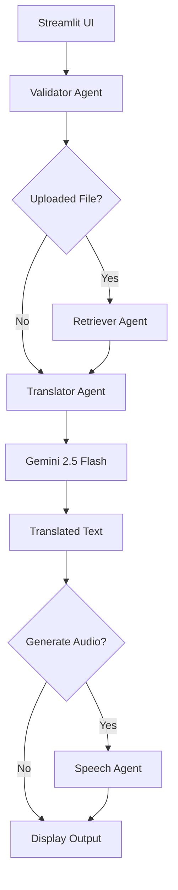

# 🌍 AI Translation Agent

An end-to-end AI-powered multilingual document translation application built with **Google Gemini**, **LangGraph**, and **Streamlit**.

The application translates text or uploaded documents into multiple languages using a modular multi-agent workflow. It also generates downloadable speech from the translated output.

---

## Features

- 🌐 AI-powered translation using Gemini 2.5 Flash
- 🧠 LangGraph workflow orchestration
- 📄 Translate documents
  - TXT
  - PDF
  - CSV
  - Excel (.xlsx)
- 🎙 Generate speech (MP3)
- 🔒 Guardrails for validation
- 📊 Translation statistics
- 🎨 Modern Streamlit UI
- ⚡ Modular agent architecture

---

## Tech Stack

| Layer | Technology |
|--------|------------|
| Frontend | Streamlit |
| Workflow | LangGraph |
| LLM | Google Gemini 2.5 Flash |
| Speech | gTTS |
| PDF | PyPDF |
| CSV | Pandas |
| Excel | OpenPyXL |
| Environment | Python 3.11 |

---

# Project Structure

```
gemini-langgraph-app/
│
├── agents/
│   ├── translator_agent.py
│   ├── retriever_agent.py
│   ├── validator_agent.py
│   └── speech_agent.py
│
├── app/
│   ├── graph.py
│   ├── state.py
│   ├── router.py
│   ├── config.py
│   └── main.py
│
├── guardrails/
│   ├── file_guard.py
│   ├── input_guard.py
│   ├── language_guard.py
│   └── prompt_guard.py
│
├── services/
│   ├── gemini_service.py
│   ├── file_service.py
│   ├── pdf_service.py
│   ├── csv_service.py
│   ├── excel_service.py
│   └── speech_service.py
│
├── ui/
│   ├── sidebar.py
│   ├── cards.py
│   ├── styles.py
│   ├── uploader.py
│   ├── translator_ui.py
│   └── audio_player.py
│
├── tests/
├── data/
├── requirements.txt
└── README.md
```

---

# Architecture

```
                Streamlit UI
                     │
                     ▼
             User Input / Upload
                     │
                     ▼
              LangGraph Workflow
                     │
      ┌──────────────┴──────────────┐
      │                             │
 Validator Agent             Retriever Agent
      │                             │
      └──────────────┬──────────────┘
                     ▼
             Translator Agent
                     │
          Google Gemini API
                     │
                     ▼
              Translated Text
                     │
                     ▼
              Speech Agent
                     │
                     ▼
             MP3 Audio Output
```

---

# LangGraph Workflow

```
START

↓

Validator

↓

Retriever

↓

Translator

↓

Speech

↓

END
```

---

# Guardrails

The application contains lightweight guardrails that validate user input before reaching the LLM.

### Input Guard

- Empty input detection
- Maximum character validation

### Language Guard

- Supported language validation
- Language normalization

### Prompt Guard

- Prompt sanitization
- Whitespace cleanup
- Prompt truncation

### File Guard

- Supported extensions
- Upload validation

---

# Installation

Clone the repository

```bash
git clone https://github.com/technosree26-byte/gemini-langgraph-app.git
```

Move inside the project

```bash
cd gemini-langgraph-app
```

Create a virtual environment

```bash
python -m venv venv
```

Activate

Windows

```bash
venv\Scripts\activate
```

Linux / Mac

```bash
source venv/bin/activate
```

Install dependencies

```bash
pip install -r requirements.txt
```

---

# Environment Variables

Create a `.env` file

```
GEMINI_API_KEY=YOUR_API_KEY
```

---

# Run

```
streamlit run app/main.py
```

---

# Supported Languages

- English
- French
- Spanish
- German
- Hindi
- Tamil
- Chinese
- Japanese

---

# Future Improvements

- OCR support
- Image translation
- Translation memory
- Multiple LLM providers
- Azure Speech
- Whisper speech recognition
- Docker deployment
- CI/CD using GitHub Actions

---

# Screenshots

Add screenshots here after running the application.

---

# Author

Santasree

---

# License

MIT License


## 🏗️ System Architecture


