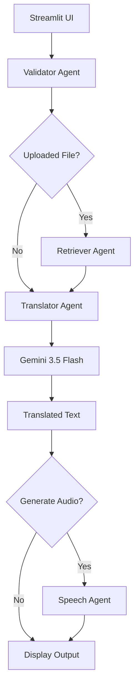
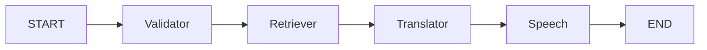
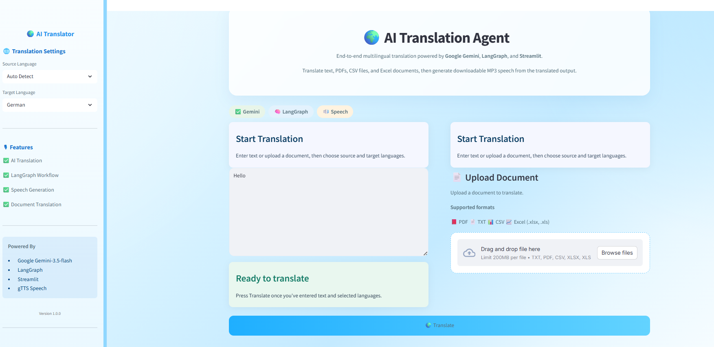

# 🌍 AI Translation Agent

An end-to-end AI-powered multilingual document translation application built with **Google Gemini**, **LangGraph**, and **Streamlit**.

The application translates text or uploaded documents into multiple languages using a modular multi-agent workflow. It can also generate downloadable MP3 speech from the translated output.

[](https://www.python.org/)
[](https://streamlit.io/)
[](https://www.langchain.com/langgraph)
[](LICENSE)

---
## 🚀 Live Demo

🔗 **Deployed Application:** https://technosree26-byte-gemini-langgraph-app-appmain-tqfz0m.streamlit.app/

## ✨ Features

* 🌐 AI-powered translation using **Gemini 3.5 Flash**
* 🧠 Workflow orchestration with **LangGraph**
* 📄 Document translation support for:

  * TXT
  * PDF
  * CSV
  * Excel (.xlsx)
* 🎙 MP3 speech generation using **gTTS**
* 🔒 Input and file validation guardrails
* 📊 Translation statistics
* 🎨 Modern Streamlit user interface
* ⚡ Modular multi-agent architecture

---

## 🛠 Tech Stack

| Layer            | Technology              |
| ---------------- | ----------------------- |
| Frontend         | Streamlit               |
| Workflow         | LangGraph               |
| LLM              | Google Gemini 3.5 Flash |
| Speech           | gTTS                    |
| PDF Processing   | PyPDF                   |
| CSV Processing   | Pandas                  |
| Excel Processing | OpenPyXL                |
| Environment      | Python 3.11             |

---

## 🏗 System Architecture



---

## 🔄 LangGraph Workflow



---

## 📁 Project Structure

```text
gemini-langgraph-app/
│
├── agents/
│   ├── translator_agent.py
│   ├── retriever_agent.py
│   ├── validator_agent.py
│   └── speech_agent.py
│
├── app/
│   ├── graph.py
│   ├── state.py
│   ├── router.py
│   ├── config.py
│   └── main.py
│
├── guardrails/
│   ├── file_guard.py
│   ├── input_guard.py
│   ├── language_guard.py
│   └── prompt_guard.py
│
├── services/
│   ├── gemini_service.py
│   ├── file_service.py
│   ├── pdf_service.py
│   ├── csv_service.py
│   ├── excel_service.py
│   └── gtts_service.py
│
├── ui/
│   ├── sidebar.py
│   ├── cards.py
│   ├── styles.py
│   ├── uploader.py
│   ├── translator_ui.py
│   └── audio_player.py
│
├── tests/
├── data/
├── requirements.txt
└── README.md
```

---

## 🛡 Guardrails

The application includes lightweight guardrails that validate user input before it reaches the LLM.

### Input Guard

* Detects empty input
* Enforces maximum character limits

### Language Guard

* Validates supported languages
* Normalizes language names

### Prompt Guard

* Sanitizes prompts
* Removes excessive whitespace
* Truncates overly long prompts

### File Guard

* Validates uploaded files
* Restricts unsupported file extensions

---

## 🚀 Installation

### 1. Clone the repository

```bash
git clone https://github.com/technosree26-byte/gemini-langgraph-app.git
cd gemini-langgraph-app
```

### 2. Create a virtual environment

```bash
python -m venv venv
```

### 3. Activate the virtual environment

**Windows**

```bash
venv\\Scripts\\activate
```

**Linux / macOS**

```bash
source venv/bin/activate
```

### 4. Install dependencies

```bash
pip install -r requirements.txt
```

---

## 🔑 Environment Variables

Create a `.env` file in the project root:

```env
GEMINI_API_KEY=your_actual_api_key_here
GEMINI_MODEL=gemini-3.5-flash
```

### Create a Gemini API Key

1. Visit **Google AI Studio**: https://aistudio.google.com/app/apikey
2. Sign in with your Google account.
3. Click **Create API Key**.
4. Copy the generated key and add it to your `.env` file.

> **Security Note:** Never commit your `.env` file or API keys to GitHub.

---

## ▶️ Run the Application

Start the Streamlit server:

```bash
streamlit run app/main.py
```

Open the local URL shown in the terminal (usually `http://localhost:8501`).

---

## 🌐 Supported Languages

* English
* French
* Spanish
* German
* Hindi
* Tamil
* Chinese
* Japanese

---

## 📖 How to Use

1. Select the **Source Language** from the sidebar.
2. Select the **Target Language**.
3. Enter text or upload a supported document (TXT, PDF, CSV, XLSX).
4. Click **🌍 Translate**.
5. View the translated output.
6. Play or download the generated MP3 speech.

---

## 🤔 Why LangGraph?

LangGraph was chosen to model the translation pipeline as a **stateful workflow**.

* **Validator Agent** ensures inputs are safe and supported.
* **Retriever Agent** extracts text from uploaded documents.
* **Translator Agent** communicates with Gemini.
* **Speech Agent** generates audio only when translation succeeds.

This separation of responsibilities makes the application easier to **test, debug, and extend** with future capabilities such as OCR, translation memory, or additional LLM providers.

---

## ⚙️ Design Considerations

### Security

* Gemini API keys are stored in environment variables.
* Uploaded files are validated before processing.
* Unsupported file types are rejected through guardrails.

### Performance

* Prompts are sanitized and truncated to reduce token usage.
* File extraction occurs only when a document is uploaded.
* Audio generation is skipped when no translated text is available.

### Reliability

* Each agent handles exceptions independently.
* Errors are propagated through the shared LangGraph state.
* The UI displays user-friendly error messages instead of raw stack traces.

---

## 🚧 Current Limitations

### Translation

* Translation quality depends on the Gemini model.
* Domain-specific terminology may not always be translated perfectly.
* Very large inputs are truncated for safety and performance.

### File Processing

* Scanned PDFs without embedded text are not supported.
* Image-based documents require OCR, which is not yet implemented.
* Extremely large spreadsheets may increase processing time.

### Speech

* gTTS requires an internet connection.
* Voice customization is limited compared to enterprise speech services.
* Audio is generated using a single voice per language.

---

## 🧩 Challenges Faced During Development

### 1. LangGraph Conditional Routing

**Issue:** The workflow initially produced `NameError: builder is not defined` because routing logic was placed in the wrong module.

**Solution:** Routing functions were kept in `router.py`, while graph construction remained in `graph.py`.

### 2. Streamlit Duplicate Widget Errors

**Issue:** Multiple translate buttons caused `StreamlitDuplicateElementId`.

**Solution:** The UI was refactored to use a single translate button and a cleaner rendering flow.

### 3. Gemini Model Compatibility

**Issue:** Earlier Gemini models returned 404 availability errors for newly created API keys.

**Solution:** The project was updated to use `gemini-3.5-flash`, which is supported for new users.

### 4. Speech Generation Failures

**Issue:** Audio generation was triggered even when translation failed, causing `AssertionError: No text to speak`.

**Solution:** A guard condition was added to skip speech generation when `translated_text` is empty.

### 5. File Encoding Issues

**Issue:** Some TXT files caused Unicode decoding errors.

**Solution:** File extraction was updated to use:

```python
uploaded_file.read().decode("utf-8", errors="ignore")
```

### 6. UI Layout Duplication

**Issue:** Early versions displayed duplicate upload panels and output sections.

**Solution:** The layout was redesigned into a clean two-column architecture with reusable UI components.

---

## 🧪 Testing

The project includes unit tests for core components.

Run the test suite:

```bash
pytest
```

### Test Coverage

* Input validation
* File extraction
* Translator logic
* Speech generation
* Validator agent behavior

---

## 📸 Screenshots



---
## ☁️ Deployment Options

The application is designed to be deployed using **Streamlit Community Cloud**, which is the recommended deployment platform for this project.

### Streamlit Community Cloud

1. Push the repository to GitHub.
2. Open https://share.streamlit.io
3. Connect your GitHub account.
4. Select the repository: `technosree26-byte/gemini-langgraph-app`
5. Set the main file to `app/main.py`
6. Add the following secret in the Streamlit dashboard:

```toml
GEMINI_API_KEY = "your_api_key_here"
GEMINI_MODEL = "gemini-3.5-flash"
```

During development, deployment was tested locally using:

```bash
streamlit run app/main.py
```

The application is fully compatible with Streamlit Community Cloud because all dependencies are listed in `requirements.txt` and configuration is handled through environment variables.
---
## 🔮 Future Improvements

* OCR support
* Image translation
* Translation memory
* Multiple LLM providers
* Azure Speech integration
* Whisper speech recognition
* Docker deployment
* CI/CD with GitHub Actions

---

GitHub: https://github.com/technosree26-byte

---
## 👩‍💻 Author

**Santasree**

## 📄 License

This project is licensed under the **MIT License**.